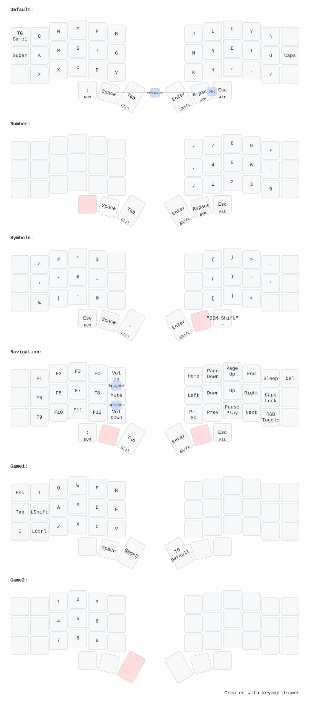

# ⌨️ Corne 3x6 Split Layout

Colemak-DH keymap for a 3x6 split keyboard (Corne).

---

## Configuration & Workflow

* **Visualizing the Layout:**  
  The layout configuration for the visual above is defined in [`keymapDrawer.yaml`](./keymapDrawer.yaml). You can render and update the SVG keymap diagrams by uploading this file to the [Keymap Drawer Web App](https.keymap-drawer.streamlit.app/).
* **Flashing & Remapping:**  
  To modify live keymaps or update layout settings on the board, open [`keymap.json`](./keymap.json) using [Vial Web](https://vial.rocks/).

---

## Layout & Ergonomic Philosophy

### Core Design Goals
* **Cross-Hand Chording:** Main functional layer hold triggers (like `NUM` on the left thumb) drive target pads on the opposite hand (right-hand numpad), keeping hand tension balanced and minimizing same-hand pinching.
* **Thumb Cluster Optimization:** Essential space, modifier, and layer controls sit on the thumb arc. Dual-role Mod-Taps handle space, enter, and escape without stretching pinkies.
* **Symbol Layer Efficiency:** Common programming brackets, operators, and syntax tokens are consolidated into a dedicated `SYM` layer, removing the need for awkward multi-modifier chording.

### Dedicated Gaming Layers
* **Game 1 (Base FPS / Action):** Dedicated left-half layout isolating standard movement (`WASD`), actions (`Q, E, R, T, F`), and modifiers (`Shift`, `Ctrl`, `Tab`).
* **Game 2 (Number Row Overlay):** Quick-access number overlay (`1–9`) for weapon selection and item hotkeys.
